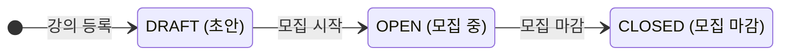
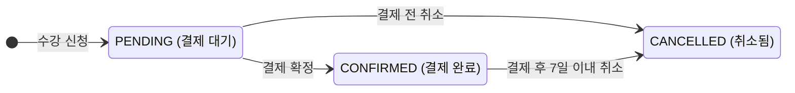

# 과제 A — 수강 신청 시스템

## 🔷 문서 바로가기

- [과제 A 요구사항](docs/be-a-assignment.md)
- [사용자 시나리오](docs/user-scenarios.md)
- [작업 히스토리](docs/epic-story-task.md)
- [깃허브 이슈](https://github.com/JangDongHo/dongho-product-engineer-be-a/issues?q=sort%3Aupdated-desc%20is%3Aissue%20state%3Aclosed)
- [깃허브 PR](https://github.com/JangDongHo/dongho-product-engineer-be-a/pulls?q=sort%3Aupdated-desc+is%3Apr+is%3Aclosed)

## 🔷 프로젝트 기간

`2026.04.25(토) ~ 2026.04.28(화)`

---

## 🔷 프로젝트 개요

크리에이터가 강의를 열고, 클래스메이트가 원하는 강의에 신청하는 과정을 백엔드 API로 구현한 프로젝트입니다.

강의 등록과 조회 같은 기본 기능은 물론, 정원 제한, 결제 확정, 수강 취소처럼 실제 수강 신청 서비스에서 필요한 흐름을 중심으로 설계했습니다.

이 프로젝트의 목표는 짧은 기간 안에 요구사항을 구현하고, 핵심 비즈니스 규칙이 의도대로 동작하는지 검증하는 것입니다.

<br>

**특히 다음 세 가지를 집중적으로 검증하려고 했습니다.**

1️⃣ 강의와 수강 신청의 상태가 정해진 흐름에 따라 올바르게 전이되는가?

2️⃣ 강의별 정원이 초과되지 않도록 신청 인원을 정확하게 관리할 수 있는가?

3️⃣ 동시에 여러 신청이 들어와도 데이터 정합성을 유지할 수 있는가?

---

## 🔷 기술 스택

- Language: Java 21
- Framework: Spring Boot 3.5.14
- ORM: Spring Data JPA, Hibernate
- Database: MySQL 8.0, H2(테스트 전용)
- Build Tool: Gradle
- Test: JUnit 5, Spring Boot Test, Mockito
- Etc: Docker Compose

---

## 🔷 실행 방법

### ✔︎ 어플리케이션 실행

```bash
./gradlew bootRun
```

- 애플리케이션은 기본적으로 8080 포트에서 실행됩니다.

### ✔︎ MySQL 실행

```bash
docker compose up -d mysql
```

- MySQL 컨테이너는 기본적으로 3306 포트에서 실행됩니다.

### ✔︎ Swagger UI 접속

```bash
http://localhost:8080/swagger-ui/index.html
```

- Swagger UI는 기본적으로 8080 포트에서 실행됩니다.

---

## 🔷 테스트 실행

```bash
./gradlew test
```

- 테스트 환경에서는 H2 인메모리 DB를 사용하므로 별도의 MySQL 실행 없이 테스트를 실행할 수 있습니다.

---

## 🔷 API 명세

### ✔︎ 강의(Class) API

| Method  | Endpoint                    | 설명                                 | 요청 Body / Query                                                                                     | 응답 코드   |
| ------- | --------------------------- | ------------------------------------ | ----------------------------------------------------------------------------------------------------- | ----------- |
| `POST`  | `/classes`                  | 강의 등록                            | `title`, `description`, `price`, `capacity`, `startDate`, `endDate` (`price` 는 KRW **원** 단위 정수) | 201 Created |
| `PATCH` | `/classes/{id}/status`      | 강의 상태 전이                       | `status` (`DRAFT` \| `OPEN` \| `CLOSED`)                                                              | 200 OK      |
| `GET`   | `/classes`                  | 강의 목록 조회                       | Query: `status` (선택), `page`, `size`                                                                | 200 OK      |
| `GET`   | `/classes/{id}`             | 강의 상세 조회                       | —                                                                                                     | 200 OK      |
| `GET`   | `/classes/{id}/enrollments` | 강의별 수강생 목록 (크리에이터 전용) | Query: `creatorId`, `page`, `size`                                                                    | 200 OK      |

#### 강의 상태 전이 규칙



### ✔︎ 수강 신청(Enrollment) API

| Method  | Endpoint                    | 설명                  | 요청 Body / Query               | 응답 코드   |
| ------- | --------------------------- | --------------------- | ------------------------------- | ----------- |
| `POST`  | `/enrollments`              | 수강 신청             | `userId`, `classId`             | 201 Created |
| `PATCH` | `/enrollments/{id}/confirm` | 결제 확정 (수강 확정) | —                               | 200 OK      |
| `PATCH` | `/enrollments/{id}/cancel`  | 수강 취소             | —                               | 200 OK      |
| `GET`   | `/enrollments`              | 내 수강 신청 목록     | Query: `userId`, `page`, `size` | 200 OK      |

#### 수강 신청 상태 전이 규칙



### ✔︎ 목록 조회 페이지네이션

- Offset 기반 페이지네이션을 사용합니다.
- `page`는 0부터 시작하며 기본값은 `0`입니다.
- `size`는 기본값 `20`, 최댓값 `100`입니다.
- 페이지네이션이 적용된 목록 API는 응답 루트에서 `data`와 `meta`를 분리해 반환합니다.

### ✔︎ 에러 응답

| HTTP 코드         | 상황                                                           |
| ----------------- | -------------------------------------------------------------- |
| `400 Bad Request` | 필수 항목 누락 / 허용되지 않는 상태 전이 / 취소 가능 기간 초과 |
| `403 Forbidden`   | 본인 강의가 아닌 수강생 목록 조회 시도                         |
| `404 Not Found`   | 존재하지 않는 강의 또는 신청 ID                                |
| `409 Conflict`    | 정원 초과 / 동일 강의 중복 신청                                |

---

## 🔷 데이터 모델


- 각 테이블의 PK는 Auto Increment 방식을 사용했습니다.
- 수강 신청 테이블의 `class_id` 컬럼은 강의 테이블을 참조하는 FK입니다.
- 같은 수강생이 같은 강의를 중복 신청하지 못하도록 (`class_id`, `user_id`) 에 유니크 제약 조건을 두었습니다.
- 사용자별 신청 내역을 최신순으로 조회할 수 있도록 수강 신청 테이블에 `user_id,created_at,id` 복합 인덱스를 추가했습니다.

---

## 🔷 요구사항 해석 및 가정

### ✔︎ 요구사항 해석

본 과제에서는 수강 신청 시스템의 핵심 요구사항을 다음과 같이 해석했습니다.

#### 강의 관리

- 크리에이터는 여러 개의 강의를 개설할 수 있다.
- 하나의 강의에는 신청 가능 정원이 존재한다.
- 크리에이터는 강의별 클래스메이트 목록을 확인할 수 있다.

#### 수강 신청 관리

- 클래스메이트는 여러 개의 다른 강의를 신청할 수 있다.
- 클래스메이트는 동일 강의를 중복 신청할 수 없다.
- 수강 신청 시 강의의 시작·종료 일시는 신청 가능 여부에 반영하지 않는다. (가정)
- 클래스메이트는 내 수강 신청 목록을 확인할 수 있다.

#### 정원 관리 규칙

- 정원이 초과된 강의는 신청할 수 없다.
- 현재 신청 인원은 `PENDING` 또는 `CONFIRMED` 상태의 수강 신청 건을 기준으로 계산한다.
- 누군가 수강 취소(`CANCELLED`)를 할 경우 현재 신청 인원에서 제외된다.
- 동시에 여러 사용자가 같은 강의를 신청하는 상황에서도 정원 초과가 발생하지 않아야 한다.

#### 결제 규칙

- 수강 취소는 결제 후 7일 이내에만 가능하다.

---

## 🔷 설계 결정과 이유

### ✔︎ 현재 신청 인원 계산

조회 성능을 개선하기 위해 현재 신청 인원을 별도의 컬럼으로 관리하고, 수강 신청/취소 시 트랜잭션 내에서 값을 증감하도록 설계했습니다.  
수강 신청과 취소가 빈번한 시스템 특성상 강의 조회와 정원 체크가 자주 발생하기 때문에, 매번 `COUNT()`로 인원을 계산하는 방식은 비효율적이라고 판단했습니다.

### ✔︎ 신청 인원 관리 전략

동시 결제로 인한 정원 초과를 방지하기 위해 결제 대기 상태의 사용자도 현재 신청 인원에 포함되도록 설계했습니다.  
이를 제외할 경우 여러 사용자가 동시에 결제 단계에 진입하면서, 최종 확정 시점에 정원이 초과될 수 있기 때문입니다.  
따라서 신청 시점에 좌석을 선점하고, 취소 시 반환하는 방식으로 처리했습니다.

다만 결제 대기 상태가 장시간 유지될 경우 좌석이 불필요하게 점유될 수 있습니다.  
현재 구현 범위에서는 만료 처리까지 포함하지 않았지만, 실제 운영 환경에서는 일정 시간이 지나면 자동으로 신청을 취소하고 좌석을 반환하는 방식이 필요하다고 판단했습니다.

### ✔︎ 동시성 제어 전략

수강 신청의 동시성 문제를 해결하기 위해 비관적 락을 사용했습니다.

수강 신청은 여러 사용자가 동시에 마지막 좌석에 접근할 수 있는 구조이기 때문에,
정원 확인과 신청 인원 증가를 하나의 트랜잭션에서 처리해야 했습니다.

처음에는 단순 조회 후 증가 방식으로 구현했지만, 동시 요청 시 정원을 초과할 수 있는 문제가 있다고 판단했습니다.
그래서 강의 row를 PESSIMISTIC_WRITE로 조회하여 SELECT ... FOR UPDATE 락을 걸고,
정원 검증과 현재 신청 인원 증가를 하나의 트랜잭션에서 함께 처리했습니다.

낙관적 락도 고려했지만, 충돌 시 재시도 로직이 필요하다는 점에서
이번 과제에서는 하나의 요청만 성공시키고 나머지는 즉시 실패(409) 하는 방식이 더 적합하다고 판단했습니다.

또한 수강 취소 역시 동일하게 락을 적용하여 신청/취소가 동시에 발생해도 신청 인원이 일관되게 유지되도록 했습니다.

### ✔︎ 중복 신청 방지

중복 신청을 방지하기 위해 애플리케이션 레벨의 사전 검증과 DB 유니크 제약을 함께 적용했습니다.  
애플리케이션에서는 `existsByUserIdAndClassId`로 중복 여부를 확인하고, DB에는 `(user_id, class_id)` 유니크 제약을 설정하여 동시성 상황에서도 데이터 정합성을 보장하도록 했습니다.  
이를 통해 불필요한 DB 예외 발생을 줄이면서도 안정성을 확보했습니다.

### ✔︎ 페이지네이션 적용

페이지네이션은 Offset 기반으로 구현했습니다.

페이지 방식과 무한 스크롤 방식 중 어떤 UI 형태를 기준으로 API를 설계해야 할지 고민했습니다.
과제 명세만으로는 실제 화면이 페이지 이동 방식인지, 무한 스크롤 방식인지 알기 어려웠기 때문입니다.
라이브클래스의 실제 운영 API에서는 Offset 기반 페이지네이션을 사용하고 있어서, 이번 구현에서도 이를 참고해 Offset 기반으로 구현했습니다.

Offset 방식은 `page`, `size`만으로 구현이 단순하고, 특정 페이지로 이동하기 쉽다는 장점이 있습니다.
하지만 데이터가 많아질수록 뒤쪽 페이지 조회 성능이 떨어질 수 있기에, 데이터가 많아지면 Cursor 기반 페이지네이션도 고려할 수 있을 것 같습니다.

### ✔︎ 수강 취소 경계값 테스트

시간 의존 로직을 안정적으로 테스트하기 위해 `LocalDateTime.now()` 대신 Clock을 주입하도록 설계했습니다.  
이를 통해 시간을 외부에서 제어 가능하게 만들어 결제 후 7일과 같은 경계값을 정확하게 검증할 수 있도록 했습니다.

---

## 🔷 미구현 / 제약사항

- 대기열 기능은 기한 내에 구현하지 못했습니다. 가능하다면 면접 전까지 어떻게 구현하면 좋을지에 대해서 고민하겠습니다.
- 인증/인가는 별도로 구현하지 않고, 쿼리 파라미터 또는 body에 userId를 전달받아 처리하도록 했습니다.
- 결제 확정 처리는 외부 결제 시스템 연동 없이 단순 상태 변경으로 대체했습니다.

---

## 🔷 AI 활용 현황

### ✅ AI를 적극적으로 활용한 부분

- 생소한 개념 비교 학습
  - 기존에 익숙했던 Node.js와 과제에서 사용한 Java/Spring의 차이를 이해하는 데 활용했습니다.
  - 예외 처리 방식, 계층 구조, 테스트 작성 방식처럼 처음 접하는 부분을 비교하며 학습했습니다.

- 명세 문서화
  - 요구사항을 바탕으로 사용자 시나리오를 정리할 때 활용했습니다.
  - 기능을 Epic, Story, Task 단위로 나누어 작업 범위를 정리하는 데 도움을 받았습니다.
  - 작성된 문서는 과제 요구사항과 맞는지 직접 확인하며 수정했습니다.

- 테스트 코드 작성
  - 정상 케이스와 예외 케이스를 빠뜨리지 않기 위해 테스트 케이스 아이디어를 얻는 데 활용했습니다.
  - Given-When-Then 구조로 테스트를 정리하는 데 참고했습니다.
  - 최종 테스트 코드는 실제 구현 내용에 맞게 직접 수정했습니다.

- CodeRabbit을 활용한 코드 리뷰
  - PR 단위로 리뷰를 받아 놓친 부분이나 개선할 수 있는 부분을 확인했습니다.
  - 리뷰 내용을 그대로 반영하기보다는 현재 과제 범위에 맞는 내용인지 판단한 뒤 적용했습니다.

### ❌ AI를 덜 활용한 부분

- 요구사항 분석
  - 어떤 기능이 핵심인지, 예외 상황을 어떻게 처리할지는 직접 판단했습니다.
  - 특히 수강 신청 가능 조건, 중복 신청, 정원 초과 같은 주요 정책은 요구사항을 기준으로 직접 정리했습니다.

- 데이터 모델 설계
  - 강의와 수강 신청 테이블 구조, FK 관계, 유니크 제약 조건은 직접 설계했습니다.
  - AI는 설계 후 설명을 다듬는 용도로만 활용했습니다.

- AI가 작성한 문서 검토 및 수정
  - AI가 작성한 초안은 그대로 사용하지 않고, 표현이 과하거나 실제 구현과 맞지 않는 부분을 직접 수정했습니다.
  - 최종 제출 문서는 제가 이해하고 설명할 수 있는 수준으로 다시 정리했습니다.
