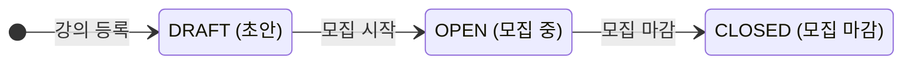
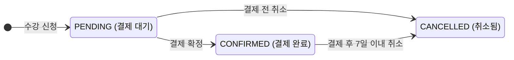

# 과제 A — 수강 신청 시스템

## 🔷 프로젝트 개요

## 🔷 요구사항 해석 및 가정

---

### ✔︎ 요구사항 해석

본 과제에서는 수강 신청 시스템의 핵심 요구사항을 다음과 같이 해석했습니다.

#### 강의 관리

- 크리에이터는 여러 개의 강의를 개설할 수 있다.
- 하나의 강의에는 신청 가능 정원이 존재한다.
- 크리에이터는 강의별 클래스메이트 목록을 확인할 수 있다.

#### 수강 신청 관리

- 클래스메이트는 여러 개의 다른 강의를 신청할 수 있다.
- 클래스메이트는 동일 강의를 중복 신청할 수 없다.
- 수강 신청 시 강의의 시작·종료 일시는 신청 가능 여부에 반영하지 않는다. (가정)
- 클래스메이트는 내 수강 신청 목록을 확인할 수 있다.

#### 정원 관리 규칙

- 정원이 초과된 강의는 신청할 수 없다.
- 현재 신청 인원은 `PENDING` 또는 `CONFIRMED` 상태의 수강 신청 건을 기준으로 계산한다.
- 누군가 수강 취소(`CANCELLED`)를 할 경우 현재 신청 인원에서 제외된다.
- 동시에 여러 사용자가 같은 강의를 신청하는 상황에서도 정원 초과가 발생하지 않아야 한다.

#### 결제 규칙

- 수강 취소는 결제 후 7일 이내에만 가능하다.

## 🔷 설계 결정과 이유

### ✔︎ 현재 신청 인원 계산

조회 성능을 개선하기 위해 현재 신청 인원을 별도의 컬럼으로 관리하고, 수강 신청/취소 시 트랜잭션 내에서 값을 증감하도록 설계했습니다.  
수강 신청과 취소가 빈번한 시스템 특성상 강의 조회와 정원 체크가 자주 발생하기 때문에, 매번 `COUNT()`로 인원을 계산하는 방식은 비효율적이라고 판단했습니다.

### ✔︎ 신청 인원 관리 전략

동시 결제로 인한 정원 초과를 방지하기 위해 결제 대기 상태의 사용자도 현재 신청 인원에 포함되도록 설계했습니다.  
이를 제외할 경우 여러 사용자가 동시에 결제 단계에 진입하면서, 최종 확정 시점에 정원이 초과될 수 있기 때문입니다.  
따라서 신청 시점에 좌석을 선점하고, 취소 시 반환하는 방식으로 처리했습니다.

다만 결제 대기 상태가 장시간 유지될 경우 좌석이 불필요하게 점유될 수 있습니다.  
현재 구현 범위에서는 만료 처리까지 포함하지 않았지만, 실제 운영 환경에서는 일정 시간이 지나면 자동으로 신청을 취소하고 좌석을 반환하는 방식이 필요하다고 판단했습니다.

### ✔︎ 동시성 제어 전략

수강 신청의 동시성 문제를 해결하기 위해 비관적 락을 사용했습니다.

수강 신청은 여러 사용자가 동시에 마지막 좌석에 접근할 수 있는 구조이기 때문에,
정원 확인과 신청 인원 증가를 하나의 트랜잭션에서 처리해야 했습니다.

처음에는 단순 조회 후 증가 방식으로 구현했지만, 동시 요청 시 정원을 초과할 수 있는 문제가 있다고 판단했습니다.
그래서 강의 row를 PESSIMISTIC_WRITE로 조회하여 SELECT ... FOR UPDATE 락을 걸고,
정원 검증과 현재 신청 인원 증가를 하나의 트랜잭션에서 함께 처리했습니다.

낙관적 락도 고려했지만, 충돌 시 재시도 로직이 필요하다는 점에서
이번 과제에서는 하나의 요청만 성공시키고 나머지는 즉시 실패(409) 하는 방식이 더 적합하다고 판단했습니다.

또한 수강 취소 역시 동일하게 락을 적용하여 신청/취소가 동시에 발생해도 신청 인원이 일관되게 유지되도록 했습니다.

### ✔︎ 중복 신청 방지

중복 신청을 방지하기 위해 애플리케이션 레벨의 사전 검증과 DB 유니크 제약을 함께 적용했습니다.  
애플리케이션에서는 `existsByUserIdAndClassId`로 중복 여부를 확인하고, DB에는 `(user_id, class_id)` 유니크 제약을 설정하여 동시성 상황에서도 데이터 정합성을 보장하도록 했습니다.  
이를 통해 불필요한 DB 예외 발생을 줄이면서도 안정성을 확보했습니다.

### ✔︎ 수강 취소 경계값 테스트

시간 의존 로직을 안정적으로 테스트하기 위해 `LocalDateTime.now()` 대신 Clock을 주입하도록 설계했습니다.  
이를 통해 시간을 외부에서 제어 가능하게 만들어 결제 후 7일과 같은 경계값을 정확하게 검증할 수 있도록 했습니다.

### ✔︎ 미구현 / 제약사항

- 인증/인가는 별도로 구현하지 않고, 파라미터(혹은 body)에 userId를 전달받아 처리합니다.
- 결제 확정 처리는 외부 결제 시스템 연동 없이 단순 상태 변경으로 대체했습니다.

## 🔷 기술 스택

- Language: Java 21
- Framework: Spring Boot 3.5.14
- ORM: JPA
- Database: MySQL
- Build Tool: Gradle
- Test: JUnit 5, Spring Boot Test, H2(테스트 전용 in-memory)

## 🔷 테스트 실행

- **전체 테스트** (프로젝트 루트):

  ```bash
  ./gradlew test
  ```

- 테스트는 H2 인메모리 DB를 쓰므로, 별도로 **MySQL을 띄우지 않아도** 테스트를 실행할 수 있습니다.

## 🔷 데이터 모델


- User는 별도의 테이블로 관리하지 않고, 파라미터로 전달되는 `userId`를 기준으로 처리했습니다.
- PK는 Auto Increment?

## 🔷 API 명세

### 강의(Class) API

| Method  | Endpoint                    | 설명                                 | 요청 Body / Query                                                                                     | 응답 코드   |
| ------- | --------------------------- | ------------------------------------ | ----------------------------------------------------------------------------------------------------- | ----------- |
| `POST`  | `/classes`                  | 강의 등록                            | `title`, `description`, `price`, `capacity`, `startDate`, `endDate` (`price` 는 KRW **원** 단위 정수) | 201 Created |
| `PATCH` | `/classes/{id}/status`      | 강의 상태 전이                       | `status` (`DRAFT` \| `OPEN` \| `CLOSED`)                                                              | 200 OK      |
| `GET`   | `/classes`                  | 강의 목록 조회                       | Query: `status` (선택), `page`, `size`                                                                | 200 OK      |
| `GET`   | `/classes/{id}`             | 강의 상세 조회                       | —                                                                                                     | 200 OK      |
| `GET`   | `/classes/{id}/enrollments` | 강의별 수강생 목록 (크리에이터 전용) | Query: `creatorId`, `page`, `size`                                                                    | 200 OK      |

#### 목록 조회 페이지네이션

- Offset 기반 페이지네이션을 사용합니다.
- `page`는 0부터 시작하며 기본값은 `0`입니다.
- `size`는 기본값 `20`, 최댓값 `100`입니다.
- 페이지네이션이 적용된 목록 API는 응답 루트에서 `data`와 `meta`를 분리해 반환합니다.

```json
{
  "success": true,
  "data": [
    {
      "id": 1,
      "creatorId": 10,
      "title": "Spring Boot 실전 클래스",
      "status": "OPEN",
      "price": 10000,
      "capacity": 30,
      "startDate": "2026-05-01T10:00:00",
      "endDate": "2026-05-30T18:00:00"
    }
  ],
  "meta": {
    "page": 0,
    "size": 20,
    "totalElements": 42,
    "totalPages": 3,
    "hasNext": true,
    "hasPrevious": false,
    "nextPage": 1
  }
}
```

#### 강의 상태 전이 규칙



### 수강 신청(Enrollment) API

| Method  | Endpoint                    | 설명                  | 요청 Body / Query               | 응답 코드   |
| ------- | --------------------------- | --------------------- | ------------------------------- | ----------- |
| `POST`  | `/enrollments`              | 수강 신청             | `userId`, `classId`             | 201 Created |
| `PATCH` | `/enrollments/{id}/confirm` | 결제 확정 (수강 확정) | —                               | 200 OK      |
| `PATCH` | `/enrollments/{id}/cancel`  | 수강 취소             | —                               | 200 OK      |
| `GET`   | `/enrollments`              | 내 수강 신청 목록     | Query: `userId`, `page`, `size` | 200 OK      |

#### 수강 신청 상태 전이 규칙



### 에러 응답

| HTTP 코드         | 상황                                                           |
| ----------------- | -------------------------------------------------------------- |
| `400 Bad Request` | 필수 항목 누락 / 허용되지 않는 상태 전이 / 취소 가능 기간 초과 |
| `403 Forbidden`   | 본인 강의가 아닌 수강생 목록 조회 시도                         |
| `404 Not Found`   | 존재하지 않는 강의 또는 신청 ID                                |
| `409 Conflict`    | 정원 초과 / 동일 강의 중복 신청                                |

---

## 🔷 AI 활용 범위

---

### ✅ AI를 적극적으로 활용한 부분

- 생소한 개념 비교 학습 (Node.js vs Java)
- 명세 문서화
  - 사용자 시나리오 작성
  - Epic-Story-Task 분해
- 테스트 코드 작성
- CodeRabbit을 활용한 코드 리뷰

### ❌ AI를 덜 활용한 부분

- 요구사항 분석
- 데이터 모델 설계
- AI 작성해준 문서 검토 및 수정
